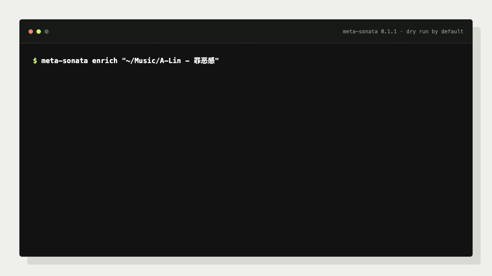
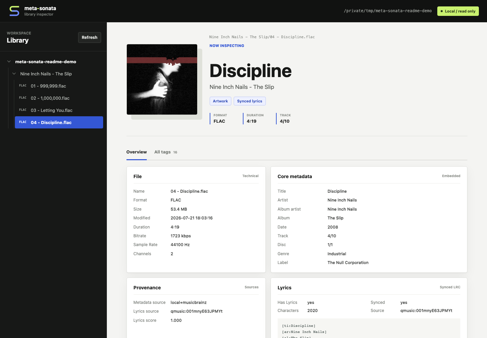

# meta-sonata

[](https://github.com/sendingE/meta-sonata/actions/workflows/tests.yml)
[](https://pypi.org/project/meta-sonata/)
[](https://www.python.org/)
[](LICENSE)

**English** | [简体中文](README.zh-CN.md)

Automatically fetch and fill missing music metadata, cover art, and synced
lyrics for your music folders. Preview the changes, then apply them with one command.

## Two Commands

Query and preview the metadata meta-sonata finds. Nothing is written:

```bash
meta-sonata enrich "/music/album"
```

Fetch and write metadata, cover art, and lyrics in one step:

```bash
meta-sonata enrich "/music/album" --write
```

Both commands accept an album folder or a larger music directory. Existing tags,
filenames, and folder structure are trusted first; online sources fill the gaps.



## Why meta-sonata?

- **Local first:** existing tags, folder names, and track structure anchor the match.
- **Conservative:** track count, duration, live/studio, and ambiguity checks prevent risky writes.
- **Complete:** metadata, cover art, and synced lyrics in one command.
- **Automation-ready:** dry runs, external incremental state, recursive discovery, and JSON audit plans.

## Quick Start

```bash
pipx install meta-sonata
```

Or install it with `uv`:

```bash
uv tool install meta-sonata
```

Typical output:

```text
scan: root=/music/album files=12 album_groups=1 loose_tracks=0 max_depth=3
resolve: 1/1 /music/album
lyrics: 1/1 /music/album
dry run: 1 plan(s)
- album: Artist / Album: artist=Artist  album=Album  year=2006  tracks=12  confidence=0.96  lyrics=11/12
nothing written; pass --write to apply
```

`enrich` enables metadata lookup, cover lookup, and lyrics by default. It scans
up to three directory levels; use `--max-depth N` or `--recursive` when needed.

## What It Can Fill

| Area | Fields |
| --- | --- |
| Identity | title, artist, album artist, album, track/disc number |
| Release | date, label, catalog number, barcode, release type |
| Sources | MusicBrainz release/track IDs and provenance tags |
| Media | embedded cover art, synced LRC, plain lyrics |

Album metadata sources: **MusicBrainz**, **iTunes**, and **NetEase**.

Lyric sources: **QQ Music**, **NetEase**, **KuGou**, **KuWo**, and **Migu**.

```bash
meta-sonata sources
```

## Put It in a Pipeline

Run it after download/extraction/CUE splitting and before the final library sync:

```bash
meta-sonata enrich "/staging/new-music" \
  --changed-only \
  --state-dir "/var/lib/meta-sonata" \
  --write
```

Incremental state stays outside music folders. No marker files are added to albums.

## Optional Metadata Browser

```bash
meta-sonata web "/music" --host 127.0.0.1 --port 8765
```

Open `http://127.0.0.1:8765/` to browse audio files, core tags, source IDs,
technical details, covers, and embedded lyrics. The web UI has no write endpoints.



_Shown with generated silent FLAC demo files and public-domain work metadata._

## Safety

- Every write command is a dry run unless `--write` is present.
- Low-confidence lyrics and ambiguous release identities are skipped.
- Mixed loose tracks are not forced into a fake album.
- Real libraries can be protected with `META_SONATA_PROTECTED_PATHS`.
- Tests generate silent FLAC files; no copyrighted media is committed.

## More

- [Detailed guide](docs/guide.md)
- [Changelog](CHANGELOG.md)
- [Public test-fixture policy](tests/README.md)
- [MIT License](LICENSE)

Python 3.9+ is supported. The project is currently an early `0.1.x` release;
unofficial provider endpoints may change or be rate-limited.
